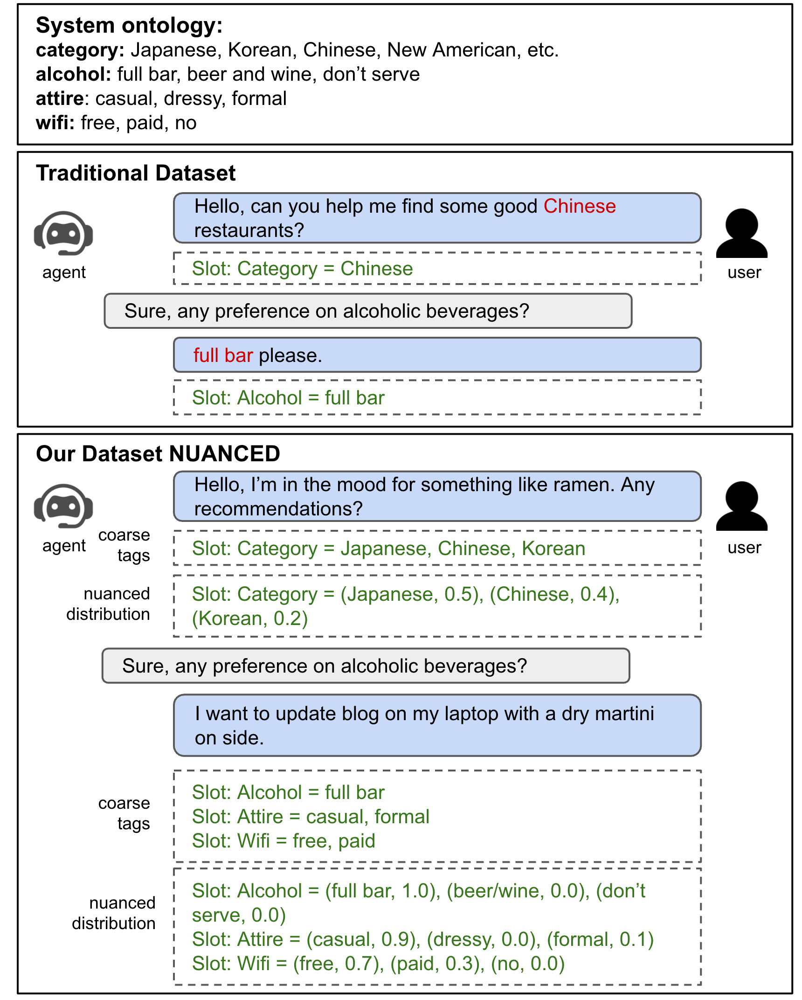

# NUANCED: Natural Utterance Annotation for Nuanced Conversation with Estimated Distributions

## Overview

NUANCED is a **user-centric conversational recommendation dataset** that contains **5.1k** annotated dialogues and **26k** high-quality user turns. The dataset focuses on realistic settings where user preferences are extracted from real-world [Yelp Open Dataset](https://www.yelp.com/dataset) and paraphrased into natural user responses. 

Existing conversational systems are mostly agent-centric, which assumes the user utterances would closely follow the system ontology (for NLU or dialogue state tracking). However, in real-world scenarios, it is highly desirable that the users can speak freely in their own way. It is extremely hard, if not impossible, for the users to adapt to the unknown system ontology. 

In this work, we attempt to build a user-centric dialogue system. As there is no clean mapping for a user’s free form utterance to an ontology, we first model the user preferences as estimated distributions over the system ontology and map the users’ utterances to such distributions. Learning such a mapping poses new challenges on reasoning over existing knowledge, ranging from factoid knowledge, commonsense knowledge to the users’ own situations. To this end, we build a new dataset named NUANCED that focuses on such realistic settings for conversational recommendation. We believe NUANCED can serve as a valuable resource to push existing research from the agent-centric system to the user-centric system.

<figure>
 
<figcaption><i>Examples of traditional dataset and NUANCED: in real-world scenarios, the free form user utterances often mismatch with system ontology. In NUANCED, we model the user preferences (or dialogue state) as distributions over the ontology, therefore to allow mapping of entities unknown to the system to multiple values and slots for efficient conversation.</i></figcaption> 
</figure>

For more details, please refer to this [paper](https://arxiv.org/pdf/2010.12758.pdf) and this [paper](https://aclanthology.org/2020.coling-main.463.pdf).

## Data

In this data release, we have included both the nuanced version where user preferences are mapped to an estimated distribution and the coarse version where user preferences are mapped to traditional slot labels according to system ontology. 

- Folder data_dist: the nuanced version;
- Folder data_discrete: the coarse version with 0-1 labels;
- meta.json: ontology for this restaurant domain;


Format for the dataset:
A list of dictionaries, with each dictionary as one dialogue of the following important fields:

- "dialogue": a list of dialog turns. Each turn has the following fields:
- "role": user or assistant
- "text": user utterance or system response
- "dialog_acts": acts of this turn
- "slots": slots involved in this turn
- "dist": for user turn, the preference distribution
- "strategy": strategy 1 means the user utterance does not have grounded ontology terms (implicit reasoning), strategy 2 means the user utterance has grounded ontology terms


## Citations

If you want to publish experimental results with our datasets or use the baseline models, please cite the following articles ([pdf](https://arxiv.org/pdf/2010.12758.pdf), [pdf](https://aclanthology.org/2020.coling-main.463.pdf)):
```
@article{chen2020nuanced,
  title={NUANCED: Natural Utterance Annotation for Nuanced Conversation with Estimated Distributions},
  author={Chen, Zhiyu and Liu, Honglei and Xu, Hu and Moon, Seungwhan and Zhou, Hao and Liu, Bing},
  journal={arXiv preprint arXiv:2010.12758},
  year={2020}
}
```
```
@inproceedings{xu2020user,
  title={User Memory Reasoning for Conversational Recommendation},
  author={Xu, Hu and Moon, Seungwhan and Liu, Honglei and Liu, Bing and Shah, Pararth and Philip, S Yu},
  booktitle={Proceedings of the 28th International Conference on Computational Linguistics},
  pages={5288--5308},
  year={2020}
}
```

## License

NUANCED is released under [CC-BY-NC-4.0](https://creativecommons.org/licenses/by-nc/4.0/), see [LICENSE](LICENSE) for details.


